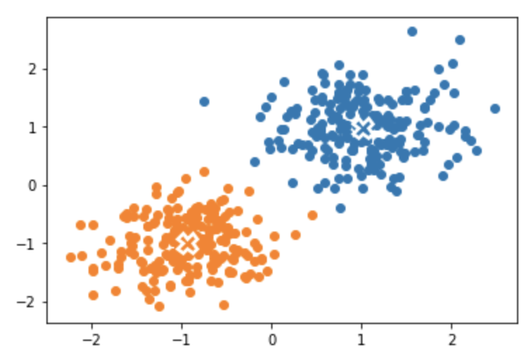
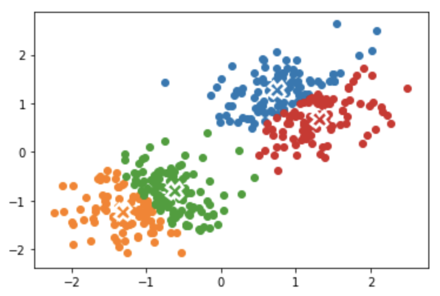
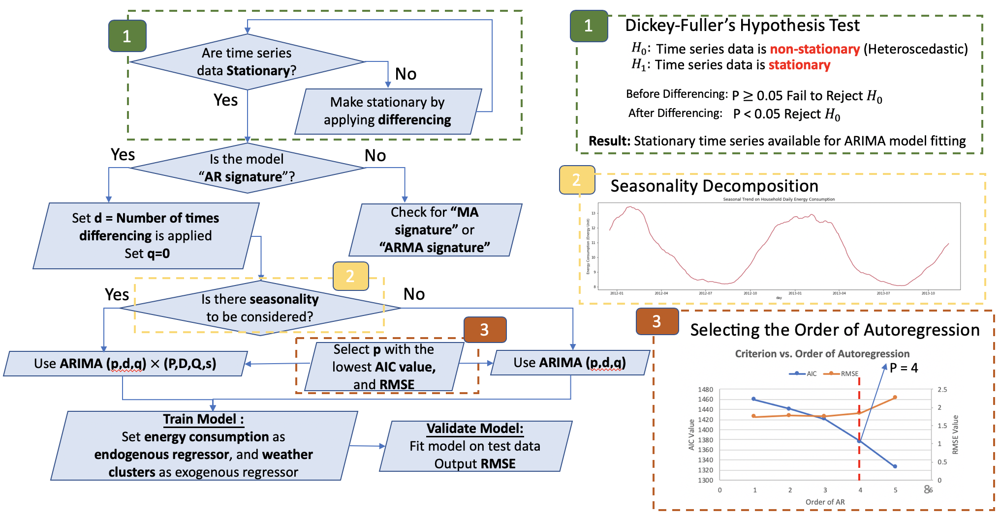
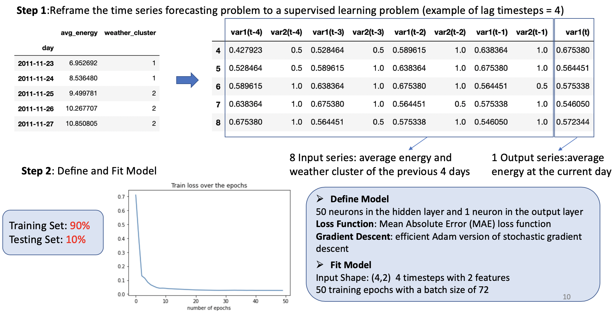

# Weather Related Energy Consumption Forecast

This project uncovers the relationship between weather conditions and energy consumption through novel machine learning approaches using empirical data. 

## Tools to be Used

Starting with using K-means to cluster the types of weather conditions as a way to reduce the regressor dimension in the subsequent models, 
the preprocessed electricity usage data are then trained using ARIMA and LSTM.

### Illustration of K-means Model on 2D Data

To illustrate the concept of kmeans, import and preprocess raw data from kmeans.csv

```python
import pandas as pd
#import os

#print(os.getcwd())
df = pd.read_csv('kmeans.csv',header = None)
#print(df.head())
x = df.to_numpy().tolist()
C = x

#inital state of all xi
plt.scatter(np.array(C)[:,0],np.array(C)[:,1])

#define initial mu
mu_ini = [[1,2],[-2,-1.5]]

```
Compute the euclidean distance from each data point to centroid mu

```python
def compute_Distance(mu,x):
# Compute euclidean distance from x_i to mu
    D = []
    for i in range(len(mu)):
        D_i = []  
        for x_i in x:
            euc_Distance = sum([pow((x_ik - mu_ik),2) for x_ik, mu_ik in zip(x_i, mu[i])])
            D_i.append(euc_Distance)
        D.append(D_i)
    #print(D)
    return D
```
k-means algorithm function

```python
def kmeans(mu, x):
    # Compute euclidean distance from x_i to mu
    D = compute_Distance(mu,x)
    # Find the minimum euclidean distance, from x_i to mu
    # Figure out weather this distance is from mu_0 or mu_1
    i = 0
    Min_D = D[i]
    while i < (len(mu)-1):
        Min_D = np.minimum(Min_D,D[i+1])
        i += 1

    # Obtain clusters of C_k of x_i
    # Color the points accordingly
    C=[]
    for k in range(len(mu)):
        C_k = []
        for i in range(len(D[k])):
            if D[k][i] == Min_D[i]:
                C_k.append(x[i])
        C.append(C_k)
    return C

```
Define cost function to determining convergence of k-means (find the number of iterations N)

```python
def costFunc(mu_k,x):
    D = []  
    for x_i in x:
        euc_Distance = sum([pow((x_ik - mu_ik),2) for x_ik, mu_ik in zip(x_i, mu_k)])
        D.append(euc_Distance)
    J = sum(D)
    return J
    
```
Plot the k clusters given the current mu value, update mu value for the next iteration 
num of iterations -> uses 1 initial mu and N-1 calculated mu

```python
def runKmeans(x,N,mu_ini):
    mu = mu_ini
    counter = 0
    while counter < N:
        C = kmeans(mu,x)
        # Plot current mu with cross
        # Uncomment plt.figure to show figures from each iterations
        # Comment plt.figure, first and last figures shown
        plt.figure()
        for i in range(len(mu)):
            plt.plot(np.array(mu[i])[0],np.array(mu[i])[1],marker='X',markersize = 14,\
            markeredgecolor = 'white',markeredgewidth = 2.5)
            #Plot the k clusters of x
            plt.scatter(np.array(C[i])[:,0],np.array(C[i])[:,1])
        
        # Update mu value for next iteration
        total_cost = sum([costFunc(mu[k],C[k]) for k in range(len(mu))])
        print(total_cost)
        mu = [list(np.average(C[k],axis = 0)) for k in range(len(mu))]
        #total_cost = sum([costFunc(mu[k],C[k]) for k in range(len(mu))])
        #print(total_cost)
        # Update Counter
        counter +=1
    return counter 

```
Plot 2 Clusters and 4 Clusters

2 Clusters             |  4 Clusters
:-------------------------:|:-------------------------:
  |  

**The actual project will use kmeans from the sklearn library**

### ARIMA and LSTM

#### ARIMA

ARIMA is a generalized model of Autoregressive Moving Average (ARMA) that combines the Autoregressive (AR) process and Moving Average (MA) processes and builds a composite model of the time series. As acronym indicates, ARIMA (𝑝, 𝑑, 𝑞), captures the key elements of the model:
- **AR**: Autoregression. A regression model that uses the dependencies between an observation
and a number of lagged observations (𝑝).
- **I**: Integrated.To make the time series stationary by measuring the differences of observations
at different time (𝑑).
- **MA**: Moving Average. An approach that takes into accounts the dependency between
observations and the residual error terms when a moving average model is used to the lagged observations (𝑞).



#### LSTM

LSTM is a kind of Recurrent Neural Network (RNN) with the capability of remembering the values from earlier stages for the purpose of future use.It is a special kind of RNNs with additional features to memorize the sequence of data. The memorization of the earlier trend of the data is possible through some gates along with a memory line incorporated in a typical LSTM.


